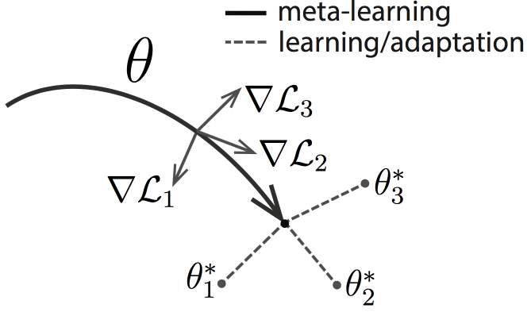
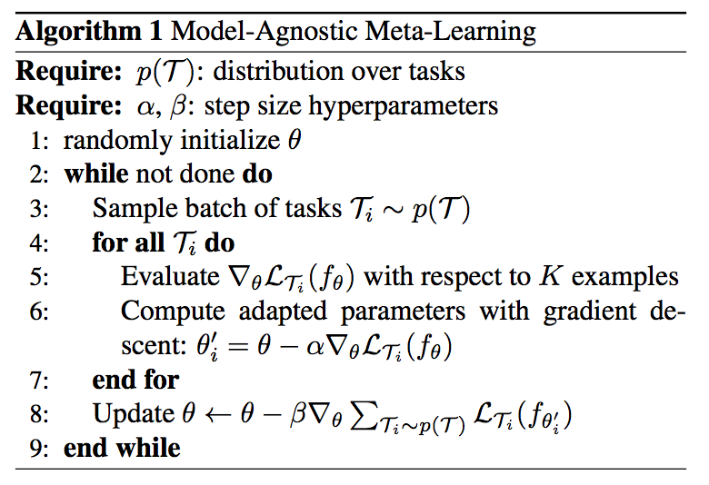
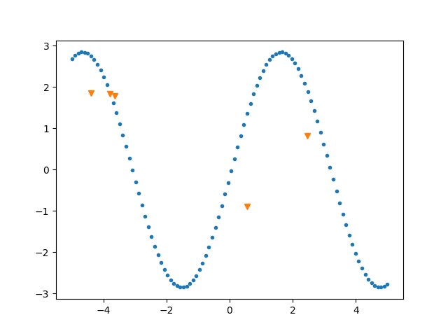
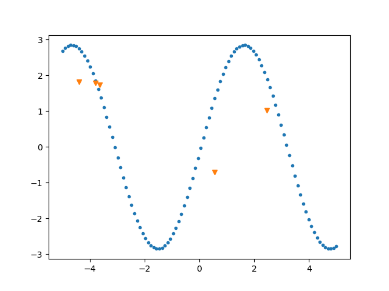
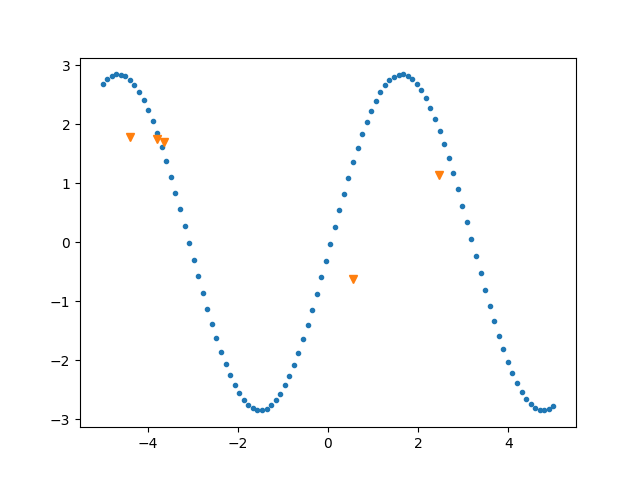
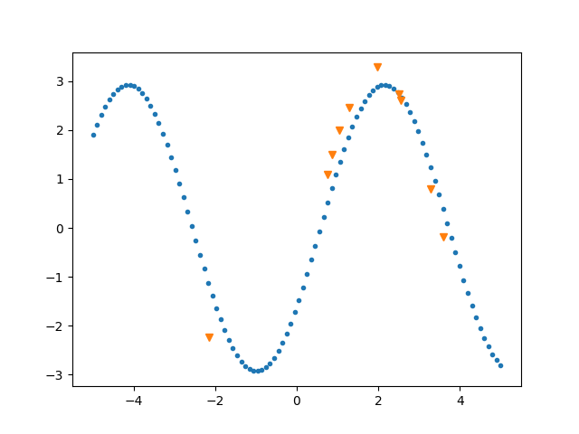
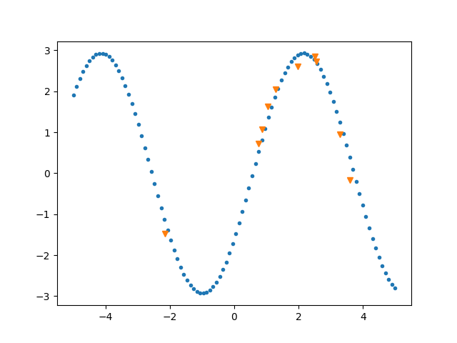
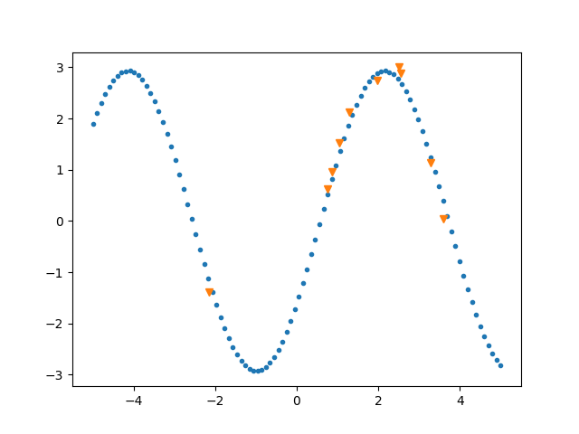

# MAML implementation in Tensorflow

As part of the implementation series of [Joseph Lim's group at USC](http://csail.mit.edu/~lim), our motivation is to accelerate (or sometimes delay) research in the AI community by promoting open-source projects. To this end, we implement state-of-the-art research papers, and publicly share them with concise reports. Please visit [our group github site](https://github.com/gitlimlab) for other projects.

This project is implemented by [Andrew Liao](https://github.com/andrewliao11) and the codes have been reviewed by [Youngwoon Lee](https://github.com/youngwoon) before being published.

## Description

Model-Agnostic Meta-Learning for Fast Adaptation of Deep Networks (MAML) aims to learn the representation that is able to adapt to new environments/goals/tasks in a few shots. Many recent work on few-shot learning rely on **meta-learning**[1,2]. Following the mainstream of previous work, MAML proposed a general meta-learning framework for few-shot learning and conducted experiments on regression, classificaiton, and reinforcement learning problems. 

<p align="center"></p>

The main idea of MAML is to minimize the number of gradient updates required to adapt to any new tasks. In other words, MAML tries to find parameters that can easily and quickly adapt to all tasks. In each iteration, a batch of tasks are sampled and data of each sampled task is splitted into meta-train and meta-val. For K-shot learning, we sample K example(s) from the meta-train. A meta network $\theta$ is trained for each task *i* using mata-train. Hence, we can get $\theta_{i}$ for each task *i* which simulates one-shot (few-shot) learning for the task *i*. Then, the meta loss for taks *i* is computed using $\theta_{i}$ with meta-val. At the end of each iteration, the parameters are updated to minimize the **sum of losses from all taks**.

The following figure is the pseudocode of MAML:

<p align="center"></p>


## Prerequisites
- Python==2.7
- Tensorflow==1.4.0
- matplotlib==2.1.0
- numpy==1.13.3
- tqdm==4.19.4
- colorlog==3.1.0

## Usage

### Regression

Train 5-shot regreesion model:
```bash
python main.py --dataset sin --K 5 --num_updates 1 --norm None --is_train
```

Details about the training FLAGs
```
--K: draw K samples as meta-train and meta-val
--model_type: for regression, I only use fully connected layers
--loss_type: for regression, I use MeanSquareError as loss criterion
--num_updates: do `num_updates` graident step for meta-step
--norm: use batch_norm or not
--alpha: learning rate for meta-train (same notation as the paper)
--beta: learning rate for meta-val (same notation as the paper)
--is_train: speficy a training phase
```

Evalaute the model (either specify the directory of the checkpoint or the checkpoint itself):
```bash
python main.py --dataset sin --K 5 --num_updates 5 --norm None --restore_checkpoint PATH_TO_CHECKPOINT
```

Details about the evaluation FLAGs (some are overlapped with training)
```
--K: draw K samples as meta-train and meta-val
--num_updates: do `num_updates` graident step for meta-step
--restore_checkpoint: specify the path to the checkpoint
--restore_dir: specify the path to the directory of the checkpoint (directly choose the latest one)
--test_sample: number of testing samples
--draw: visualize or not
```

## Results

### Regression
Model trained on: 10-shots, 1 updates, batch_size=25, without batch normalization

|   | L2 loss | Results (updates=1)| Results (updates=5)| Results (updates=10)|
|---|---|---|---|---|
| 5-shots | 0.3024  |  | | |
| 10-shots | 0.2024  |  | | |


For more regression results: check [here](misc/result_regression.md)

## What's inside the training?

### Tricks
For regression, don't use batch normalization if the `K` is small (e.g., less than 10).

## Related Work and Reference
- [1] Matching Networks for One Shot Learning
- [2] Optimization as a Model for Few-Shot Learning
- [3] Model-Agnostic Meta-Learning for Fast Adaptation of Deep Networks
